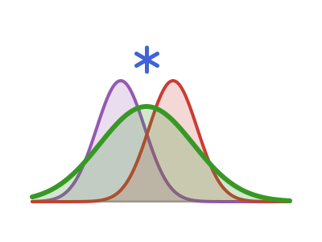

# ConvolvedDistributions 

<!-- badges:start -->
| **Documentation** | **Build Status** | **Code Quality** | **License & DOI** | **Downloads** |
|:-----------------:|:----------------:|:----------------:|:-----------------:|:-------------:|
| [](https://convolveddistributions.epiaware.org/stable/) [](https://convolveddistributions.epiaware.org/dev/) | [](https://github.com/EpiAware/ConvolvedDistributions.jl/actions/workflows/test.yaml) [](https://codecov.io/gh/EpiAware/ConvolvedDistributions.jl) [](https://github.com/EpiAware/ConvolvedDistributions.jl/actions/workflows/ad.yaml) | [](https://github.com/SciML/SciMLStyle) [](https://github.com/JuliaTesting/Aqua.jl) [](https://github.com/aviatesk/JET.jl) | [](https://opensource.org/licenses/MIT) | [](https://juliapkgstats.com/pkg/ConvolvedDistributions) [](https://juliapkgstats.com/pkg/ConvolvedDistributions) |

| ForwardDiff | ReverseDiff (tape) | Enzyme forward | Enzyme reverse | Mooncake reverse | Mooncake forward |
|:---:|:---:|:---:|:---:|:---:|:---:|
| [](https://app.codecov.io/gh/EpiAware/ConvolvedDistributions.jl?flags%5B0%5D=ad-forwarddiff) | [](https://app.codecov.io/gh/EpiAware/ConvolvedDistributions.jl?flags%5B0%5D=ad-reversediff) | [](https://app.codecov.io/gh/EpiAware/ConvolvedDistributions.jl?flags%5B0%5D=ad-enzyme-forward) | [](https://app.codecov.io/gh/EpiAware/ConvolvedDistributions.jl?flags%5B0%5D=ad-enzyme-reverse) | [](https://app.codecov.io/gh/EpiAware/ConvolvedDistributions.jl?flags%5B0%5D=ad-mooncake-reverse) | [](https://app.codecov.io/gh/EpiAware/ConvolvedDistributions.jl?flags%5B0%5D=ad-mooncake-forward) |
<!-- badges:end -->

Raw-distribution convolution and shared numeric quadrature for any `Distributions.jl` distribution.

## Why ConvolvedDistributions?

- A convolution is usually only available in closed form for a few matching distribution families; `convolved` builds the distribution of a sum of independent delays from any two or more `Distributions.jl` distributions, not just those pairs.
- Closed-form convolutions (`Normal` + `Normal`, equal-scale `Gamma`, equal-rate `Exponential`) are used where they exist, with an AD-safe Gauss-Legendre quadrature fallback for every other pair, so there is no accuracy trade-off for reaching for the general function.
- Sums are not the only combination that matters: `difference` builds the `X - Y` signed gap between two independent events, and `product` the `X * Y` Mellin convolution for a delay scaled by an independent multiplicative factor.
- Turning expected events into expected downstream counts is usually a hand-rolled discrete convolution; `convolve_series` does it directly from a numeric series and a delay's PMF (discretising a continuous delay first where needed, via `discretise_pmf` or CensoredDistributions.jl's double-interval-censored masses), with gradients flowing through the delay parameters.
- A shared `integrate`/`gl_integrate` layer means quadrature is written once, with a lightweight fixed-node default and an optional [Integrals.jl](https://github.com/SciML/Integrals.jl) backend for harder cases.
- Gradients flow through the component parameters on every supported AD backend (ForwardDiff, ReverseDiff, Enzyme, Mooncake), so a convolved distribution is fit-ready with no extra plumbing.

## Getting started

See the [Getting started documentation](https://convolveddistributions.epiaware.org/stable/getting-started/) for a full walkthrough.

The following example convolves two delays, an incubation period and a reporting delay, and evaluates the resulting distribution:

```julia
using ConvolvedDistributions, Distributions

# Sum of two independent delays
incubation = Gamma(2.0, 1.0)
reporting = LogNormal(1.0, 0.5)
d = convolved(incubation, reporting)

(cdf(d, 5.0), pdf(d, 5.0))
```

`difference` gives the signed gap between two independent events, for example the delay between two reporting streams:

```julia
z = difference(Normal(5.0, 1.0), Normal(2.0, 1.0))

(mean(z), cdf(z, 0.0))
```

A `Convolved` distribution is a `UnivariateDistribution`, so it composes with `Distributions.truncated`.
Right truncation is useful when scoring against data observed only up to a cutoff:

```julia
d_trunc = truncated(d; upper = 10.0)

cdf(d_trunc, 5.0)
```

Loading the Optimization extension adds `quantile` support by numerically inverting the CDF:

```julia
using Optimization, OptimizationOptimJL

quantile(d, 0.5)
```

The components and their sum can be compared visually, here with [AlgebraOfGraphics.jl](https://github.com/MakieOrg/AlgebraOfGraphics.jl):

```julia
using CairoMakie, AlgebraOfGraphics, DataFramesMeta

CairoMakie.activate!(type = "png", px_per_unit = 2)

x = 0.0:0.1:15.0
df = vcat(
    DataFrame(x = x, density = pdf.(incubation, x),
        Distribution = "Incubation (Gamma)"),
    DataFrame(x = x, density = pdf.(reporting, x),
        Distribution = "Reporting (LogNormal)"),
    DataFrame(x = x, density = pdf(d, collect(x)),
        Distribution = "Convolved sum")
)
draw(
    data(df) *
    mapping(:x, :density, color = :Distribution) *
    visual(Lines, linewidth = 2)
)
```

## Relationship to Distributions.jl

Distributions.jl ships a `convolve` function, but it only covers pairs with a closed-form result:

| Aspect | Distributions.jl `convolve` | ConvolvedDistributions.jl `convolved` |
|--------|-----------------------------|-----------------------------------------------------|
| **Coverage** | Closed-form, same-family pairs only (e.g. `Normal` + `Normal`, equal-scale `Gamma`); errors otherwise | Any pair of univariate distributions |
| **Method** | Returns the closed-form distribution | Analytic fast path where a closed form exists, AD-safe Gauss-Legendre quadrature fallback otherwise |
| **Forms** | Two positional arguments | Nested, vector, tuple, and varargs forms for sums of many delays |
| **Differences** | Not supported | `difference` builds the `X - Y` dual |
| **Evaluation** | Whatever the returned distribution supports | Batched `cdf` / `pdf` / `logpdf` over vectors of points |
| **Gradients** | Depend on the returned distribution | Flow through the component parameters on all supported AD backends |

For example, `Distributions.convolve(Gamma(2, 1), LogNormal(0, 1))` throws a `MethodError` and `Distributions.convolve(Gamma(2, 1), Gamma(3, 2))` throws an `ArgumentError` because the scales differ, whereas `convolved` handles both via quadrature.
When a closed form does exist, `convolved` uses it, so there is no cost to reaching for the more general function.

## Related packages

- [ComposedDistributions.jl](https://composeddistributions.epiaware.org/dev/) re-exports this package directly, so a composed chain collapses to its convolved total via `observed_distribution`.
- [ModifiedDistributions.jl](https://modifieddistributions.epiaware.org/dev/) applies its forward-series transforms (`thin`, `cumulative`) to a convolved series, and lets modified distributions serve as convolution components.
- [LoweredDistributions.jl](https://lowereddistributions.epiaware.org/dev/) lowers a `convolved` sum to one combined dynamical-systems representation, folding the components' phase-types in series rather than lowering each separately.
- [CensoredDistributions.jl](https://censoreddistributions.epiaware.org/stable/) adds censoring and truncation layers for epidemiological observation processes; this package was split out of it, and `convolve_series` reads its double-interval-censored masses directly.
- [DistributionsInference.jl](https://github.com/EpiAware/DistributionsInference.jl) is the emerging fit-protocol and PPL-integration layer across the EpiAware distribution packages.

## Where to learn more

- Want to get started running code? Check out the [Getting started documentation](https://convolveddistributions.epiaware.org/stable/getting-started/).
- Want to understand the API? Check out our [API reference](https://convolveddistributions.epiaware.org/stable/lib/public).
- Want to contribute to `ConvolvedDistributions`? Check the [open issues](https://github.com/EpiAware/ConvolvedDistributions.jl/issues) and the Contributing section below.
- Want to see our code? Check out our [GitHub Repository](https://github.com/EpiAware/ConvolvedDistributions.jl).

## Getting help

For usage questions, ask on the [Julia Discourse](https://discourse.julialang.org)
(the SciML or usage categories) or the [epinowcast community forum](https://community.epinowcast.org),
our home for epidemiological modelling questions.
Please use [GitHub issues](https://github.com/EpiAware/ConvolvedDistributions.jl/issues)
for bug reports and feature requests only.

## Contributing

We welcome contributions and new contributors! This package follows [ColPrac](https://github.com/SciML/ColPrac) and the [SciML style](https://github.com/SciML/SciMLStyle).

## Supporting and citing

If you would like to support ConvolvedDistributions, please star the repository — such metrics help secure future funding.

If you use ConvolvedDistributions in your work, please cite it:

```bibtex
@software{ConvolvedDistributions_jl,
  author       = {Sam Abbott and EpiAware contributors},
  title        = {ConvolvedDistributions.jl},
  year         = {2026},
  url          = {https://github.com/EpiAware/ConvolvedDistributions.jl}
}
```

A citable DOI will be added with the first tagged release.

## Code of conduct

Please note that the ConvolvedDistributions project is released with a [Contributor Code of Conduct](https://github.com/EpiAware/.github/blob/main/CODE_OF_CONDUCT.md). By contributing, you agree to abide by its terms.
