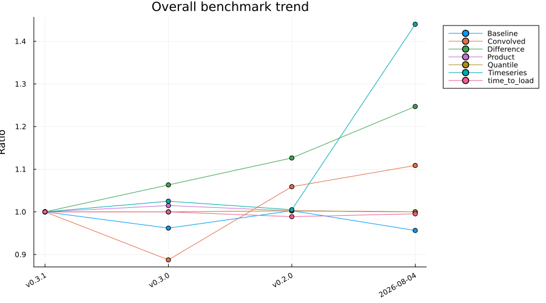

# [Performance over time](@id benchmarks)

How `ConvolvedDistributions`'s benchmark suites have moved across recent revisions: an overall summary across the package first, then one section per suite.

## Summary

Each benchmark suite's headline timing across recent revisions.

| Suite | Median ratio | Trend | Status |
|:---|:---:|:---:|:---:|
| Baseline | 0.96 | ↘ | ok |
| Convolved | 1.11 | ↗ | ⚠ reg |
| Difference | 1.25 | ↗ | ⚠ reg |
| Product | 1.0 | → | ok |
| Quantile | 1.0 | → | ok |
| Timeseries | 1.44 | ↗ | ⚠ reg |
| AD gradients | n/a | → | n/a |
| time_to_load | 1.0 | → | ok |

_Ratio: latest vs oldest shown revision (1.00 = no change, higher = slower/larger). ⚠ reg = at/above the regression threshold._



_Tables below show the most recent 4 revisions, columns labelled by commit date._

## Baseline

### Time

| Benchmark | v0.3.1 | v0.3.0 | v0.2.0 | 2026-08-04 |
|:---|:---:|:---:|:---:|:---:|
| Gamma/cdf | 2.89 ± 0.24 μs | 2.89 ± 0.24 μs | 2.91 ± 0.27 μs | 2.78 ± 0.24 μs |
| Gamma/logpdf | 2.27 ± 0.27 μs | 2.17 ± 0.29 μs | 2.28 ± 0.29 μs | 2.16 ± 0.27 μs |
| Normal/cdf | 1.4 ± 0.24 μs | 1.36 ± 0.25 μs | 1.4 ± 0.24 μs | 1.35 ± 0.24 μs |
| Normal/logpdf | 0.62 ± 0.29 μs | 0.629 ± 0.29 μs | 0.607 ± 0.29 μs | 0.866 ± 0.02 μs |

### Memory

| Benchmark | v0.3.1 | v0.3.0 | v0.2.0 | 2026-08-04 |
|:---|:---:|:---:|:---:|:---:|
| Gamma/cdf | 2  allocs: 0.906 kB | 2  allocs: 0.906 kB | 2  allocs: 0.906 kB | 2  allocs: 0.906 kB |
| Gamma/logpdf | 2  allocs: 0.906 kB | 2  allocs: 0.906 kB | 2  allocs: 0.906 kB | 2  allocs: 0.906 kB |
| Normal/cdf | 2  allocs: 0.906 kB | 2  allocs: 0.906 kB | 2  allocs: 0.906 kB | 2  allocs: 0.906 kB |
| Normal/logpdf | 2  allocs: 0.906 kB | 2  allocs: 0.906 kB | 2  allocs: 0.906 kB | 2  allocs: 0.906 kB |

## Convolved

### Time

| Benchmark | v0.3.1 | v0.3.0 | v0.2.0 | 2026-08-04 |
|:---|:---:|:---:|:---:|:---:|
| analytic/cdf batched | 2.3 ± 0.28 μs | 2.29 ± 0.28 μs | 2.28 ± 0.3 μs | 2.29 ± 0.28 μs |
| analytic/cdf scalar | 19.2 ± 0.033 ns | 19.2 ± 0.032 ns | 19.2 ± 0.053 ns | 19.2 ± 0.032 ns |
| analytic/construction | 3.25 ± 0.006 ns | 2.62 ± 0.017 ns | 3.25 ± 0.005 ns | 3.58 ± 0.006 ns |
| analytic/logpdf batched | 0.583 ± 0.089 μs | 0.594 ± 0.16 μs | 0.583 ± 0.069 μs | 0.876 ± 0.024 μs |
| analytic/logpdf broadcast | 2.06 ± 0.27 μs | 2.06 ± 0.29 μs | 2.06 ± 0.26 μs | 2.09 ± 0.27 μs |
| analytic/logpdf scalar | 18.6 ± 0.057 ns | 18.5 ± 0.053 ns | 18.6 ± 0.045 ns | 18.6 ± 0.087 ns |
| analytic/mean | 2.92 ± 0.008 ns | 2.31 ± 0.059 ns | 3.35 ± 0.11 ns | 3.57 ± 0.005 ns |
| analytic/pdf batched | 0.612 ± 0.3 μs | 0.637 ± 0.29 μs | 0.606 ± 0.29 μs | 0.889 ± 0.023 μs |
| analytic/pdf scalar | 18.9 ± 0.032 ns | 18.9 ± 0.031 ns | 18.9 ± 0.028 ns | 18.9 ± 0.05 ns |
| analytic/rand | 1.12 ± 0.22 μs | 1.11 ± 0.17 μs | 1.11 ± 0.24 μs | 1.12 ± 0.037 μs |
| numeric/cdf batched | 0.654 ± 0.0057 ms | 0.657 ± 0.0051 ms | 0.673 ± 0.0051 ms | 0.653 ± 0.0058 ms |
| numeric/cdf scalar | 14.5 ± 0.074 μs | 14.2 ± 0.07 μs | 14.2 ± 0.057 μs | 14.2 ± 0.23 μs |
| numeric/construction | 3.35 ± 0.11 ns | 2.96 ± 0.099 ns | 3.58 ± 0.006 ns | 3.58 ± 0.006 ns |
| numeric/logpdf batched | 0.518 ± 0.013 ms | 0.516 ± 0.0072 ms | 0.516 ± 0.0065 ms | 0.517 ± 0.0077 ms |
| numeric/logpdf broadcast | 0.903 ± 0.013 ms | 0.896 ± 0.012 ms | 0.897 ± 0.011 ms | 0.9 ± 0.023 ms |
| numeric/logpdf scalar | 8.56 ± 0.067 μs | 8.31 ± 0.15 μs | 8.31 ± 0.075 μs | 8.3 ± 0.076 μs |
| numeric/mean | 5.84 ± 0.19 ns | 4.88 ± 0.009 ns | 6.17 ± 0.011 ns | 6.17 ± 0.011 ns |
| numeric/pdf batched | 0.516 ± 0.011 ms | 0.516 ± 0.0065 ms | 0.516 ± 0.0072 ms | 0.515 ± 0.0066 ms |
| numeric/pdf scalar | 8.56 ± 0.099 μs | 8.3 ± 0.065 μs | 8.32 ± 0.081 μs | 8.3 ± 0.075 μs |
| numeric/rand | 2.5 ± 0.31 μs | 2.5 ± 0.3 μs | 2.49 ± 0.31 μs | 2.44 ± 0.31 μs |

### Memory

| Benchmark | v0.3.1 | v0.3.0 | v0.2.0 | 2026-08-04 |
|:---|:---:|:---:|:---:|:---:|
| analytic/cdf batched | 2  allocs: 0.906 kB | 2  allocs: 0.906 kB | 2  allocs: 0.906 kB | 2  allocs: 0.906 kB |
| analytic/cdf scalar | 0  allocs: 0 B | 0  allocs: 0 B | 0  allocs: 0 B | 0  allocs: 0 B |
| analytic/construction | 0  allocs: 0 B | 0  allocs: 0 B | 0  allocs: 0 B | 0  allocs: 0 B |
| analytic/logpdf batched | 2  allocs: 0.906 kB | 2  allocs: 0.906 kB | 2  allocs: 0.906 kB | 2  allocs: 0.906 kB |
| analytic/logpdf broadcast | 2  allocs: 0.906 kB | 2  allocs: 0.906 kB | 2  allocs: 0.906 kB | 2  allocs: 0.906 kB |
| analytic/logpdf scalar | 0  allocs: 0 B | 0  allocs: 0 B | 0  allocs: 0 B | 0  allocs: 0 B |
| analytic/mean | 0  allocs: 0 B | 0  allocs: 0 B | 0  allocs: 0 B | 0  allocs: 0 B |
| analytic/pdf batched | 2  allocs: 0.906 kB | 2  allocs: 0.906 kB | 2  allocs: 0.906 kB | 2  allocs: 0.906 kB |
| analytic/pdf scalar | 0  allocs: 0 B | 0  allocs: 0 B | 0  allocs: 0 B | 0  allocs: 0 B |
| analytic/rand | 2  allocs: 0.906 kB | 2  allocs: 0.906 kB | 2  allocs: 0.906 kB | 2  allocs: 0.906 kB |
| numeric/cdf batched | 24  allocs: 8.32 kB | 24  allocs: 8.32 kB | 24  allocs: 8.32 kB | 24  allocs: 8.32 kB |
| numeric/cdf scalar | 3  allocs: 0.172 kB | 3  allocs: 0.172 kB | 3  allocs: 0.172 kB | 3  allocs: 0.172 kB |
| numeric/construction | 0  allocs: 0 B | 0  allocs: 0 B | 0  allocs: 0 B | 0  allocs: 0 B |
| numeric/logpdf batched | 25  allocs: 8.41 kB | 25  allocs: 8.41 kB | 25  allocs: 8.41 kB | 25  allocs: 8.41 kB |
| numeric/logpdf broadcast | 0.338 k allocs: 29.8 kB | 0.338 k allocs: 29.8 kB | 0.338 k allocs: 29.8 kB | 0.338 k allocs: 29.8 kB |
| numeric/logpdf scalar | 3  allocs: 0.172 kB | 3  allocs: 0.172 kB | 3  allocs: 0.172 kB | 3  allocs: 0.172 kB |
| numeric/mean | 0  allocs: 0 B | 0  allocs: 0 B | 0  allocs: 0 B | 0  allocs: 0 B |
| numeric/pdf batched | 23  allocs: 7.5 kB | 23  allocs: 7.5 kB | 23  allocs: 7.5 kB | 23  allocs: 7.5 kB |
| numeric/pdf scalar | 3  allocs: 0.172 kB | 3  allocs: 0.172 kB | 3  allocs: 0.172 kB | 3  allocs: 0.172 kB |
| numeric/rand | 2  allocs: 0.906 kB | 2  allocs: 0.906 kB | 2  allocs: 0.906 kB | 2  allocs: 0.906 kB |

## Difference

### Time

| Benchmark | v0.3.1 | v0.3.0 | v0.2.0 | 2026-08-04 |
|:---|:---:|:---:|:---:|:---:|
| analytic/cdf broadcast | 3.12 ± 0.31 μs | 3.11 ± 0.31 μs | 3.09 ± 0.27 μs | 3.26 ± 0.3 μs |
| analytic/cdf scalar | 10.9 ± 0.025 ns | 10.5 ± 0.035 ns | 10.6 ± 0.018 ns | 10.5 ± 0.023 ns |
| analytic/construction | 2.61 ± 0.005 ns | 2.94 ± 0.097 ns | 2.61 ± 0.005 ns | 3.28 ± 0.11 ns |
| analytic/logpdf broadcast | 1.31 ± 0.26 μs | 1.29 ± 0.25 μs | 1.29 ± 0.25 μs | 1.38 ± 0.25 μs |
| analytic/logpdf scalar | 12.8 ± 0.025 ns | 12.9 ± 0.41 ns | 12.9 ± 0.033 ns | 12.9 ± 0.034 ns |
| analytic/mean | 2.29 ± 0.005 ns | 2.3 ± 0.075 ns | 2.93 ± 0.005 ns | 2.92 ± 0.012 ns |
| analytic/rand | 1.07 ± 0.28 μs | 0.945 ± 0.28 μs | 0.936 ± 0.28 μs | 1.13 ± 0.044 μs |
| numeric/cdf broadcast | 1.27 ± 0.02 ms | 1.27 ± 0.017 ms | 1.27 ± 0.018 ms | 1.28 ± 0.034 ms |
| numeric/cdf scalar | 18.2 ± 0.15 μs | 18.2 ± 0.09 μs | 18 ± 0.17 μs | 18 ± 0.6 μs |
| numeric/construction | 2.61 ± 0.012 ns | 2.61 ± 0.006 ns | 2.95 ± 0.032 ns | 3.25 ± 0.026 ns |
| numeric/logpdf broadcast | 1.12 ± 0.02 ms | 1.11 ± 0.019 ms | 1.11 ± 0.02 ms | 1.11 ± 0.028 ms |
| numeric/logpdf scalar | 11.3 ± 0.083 μs | 11.2 ± 0.37 μs | 11.1 ± 0.12 μs | 11.2 ± 0.36 μs |
| numeric/mean | 4.88 ± 0.008 ns | 5.2 ± 0.34 ns | 4.88 ± 0.01 ns | 5.84 ± 0.01 ns |
| numeric/rand | 2.53 ± 0.3 μs | 2.48 ± 0.36 μs | 2.52 ± 0.28 μs | 2.5 ± 0.31 μs |

### Memory

| Benchmark | v0.3.1 | v0.3.0 | v0.2.0 | 2026-08-04 |
|:---|:---:|:---:|:---:|:---:|
| analytic/cdf broadcast | 2  allocs: 0.906 kB | 2  allocs: 0.906 kB | 2  allocs: 0.906 kB | 2  allocs: 0.906 kB |
| analytic/cdf scalar | 0  allocs: 0 B | 0  allocs: 0 B | 0  allocs: 0 B | 0  allocs: 0 B |
| analytic/construction | 0  allocs: 0 B | 0  allocs: 0 B | 0  allocs: 0 B | 0  allocs: 0 B |
| analytic/logpdf broadcast | 2  allocs: 0.906 kB | 2  allocs: 0.906 kB | 2  allocs: 0.906 kB | 2  allocs: 0.906 kB |
| analytic/logpdf scalar | 0  allocs: 0 B | 0  allocs: 0 B | 0  allocs: 0 B | 0  allocs: 0 B |
| analytic/mean | 0  allocs: 0 B | 0  allocs: 0 B | 0  allocs: 0 B | 0  allocs: 0 B |
| analytic/rand | 2  allocs: 0.906 kB | 2  allocs: 0.906 kB | 2  allocs: 0.906 kB | 2  allocs: 0.906 kB |
| numeric/cdf broadcast | 0.402 k allocs: 0.0467 MB | 0.402 k allocs: 0.0467 MB | 0.402 k allocs: 0.0467 MB | 0.402 k allocs: 0.0467 MB |
| numeric/cdf scalar | 4  allocs: 0.469 kB | 4  allocs: 0.469 kB | 4  allocs: 0.469 kB | 4  allocs: 0.469 kB |
| numeric/construction | 0  allocs: 0 B | 0  allocs: 0 B | 0  allocs: 0 B | 0  allocs: 0 B |
| numeric/logpdf broadcast | 0.402 k allocs: 0.0467 MB | 0.402 k allocs: 0.0467 MB | 0.402 k allocs: 0.0467 MB | 0.402 k allocs: 0.0467 MB |
| numeric/logpdf scalar | 4  allocs: 0.469 kB | 4  allocs: 0.469 kB | 4  allocs: 0.469 kB | 4  allocs: 0.469 kB |
| numeric/mean | 0  allocs: 0 B | 0  allocs: 0 B | 0  allocs: 0 B | 0  allocs: 0 B |
| numeric/rand | 2  allocs: 0.906 kB | 2  allocs: 0.906 kB | 2  allocs: 0.906 kB | 2  allocs: 0.906 kB |

## Product

### Time

| Benchmark | v0.3.1 | v0.3.0 | v0.2.0 | 2026-08-04 |
|:---|:---:|:---:|:---:|:---:|
| analytic/cdf broadcast | 4.27 ± 0.19 μs | 4.35 ± 0.2 μs | 4.3 ± 0.21 μs | 4.28 ± 0.18 μs |
| analytic/cdf scalar | 20.4 ± 0.047 ns | 20.5 ± 0.061 ns | 20.4 ± 0.057 ns | 20.5 ± 0.66 ns |
| analytic/construction | 2.61 ± 0.008 ns | 2.61 ± 0.007 ns | 2.62 ± 0.32 ns | 3.25 ± 0.027 ns |
| analytic/logpdf broadcast | 1.68 ± 0.24 μs | 1.67 ± 0.24 μs | 1.67 ± 0.21 μs | 1.69 ± 0.25 μs |
| analytic/logpdf scalar | 15.8 ± 0.025 ns | 15.8 ± 0.53 ns | 15.8 ± 0.026 ns | 15.8 ± 0.023 ns |
| analytic/mean | 9.07 ± 0.65 ns | 7.88 ± 0.029 ns | 8.11 ± 0.014 ns | 8.75 ± 0.016 ns |
| analytic/rand | 3.83 ± 0.31 μs | 3.87 ± 0.32 μs | 3.82 ± 0.31 μs | 3.82 ± 0.31 μs |
| numeric/cdf broadcast | 1.42 ± 0.021 ms | 1.41 ± 0.019 ms | 1.41 ± 0.021 ms | 1.42 ± 0.038 ms |
| numeric/cdf scalar | 17.1 ± 0.12 μs | 17 ± 0.091 μs | 17 ± 0.095 μs | 17.1 ± 0.57 μs |
| numeric/construction | 2.94 ± 0.009 ns | 2.61 ± 0.006 ns | 2.61 ± 0.086 ns | 3.59 ± 0.12 ns |
| numeric/logpdf broadcast | 1.57 ± 0.019 ms | 1.19 ± 0.018 ms | 1.19 ± 0.015 ms | 1.2 ± 0.026 ms |
| numeric/logpdf scalar | 12 ± 0.086 μs | 11.8 ± 0.11 μs | 11.8 ± 0.082 μs | 11.8 ± 0.11 μs |
| numeric/mean | 4.77 ± 0.16 ns | 4.77 ± 0.15 ns | 4.89 ± 0.32 ns | 6.04 ± 0.32 ns |
| numeric/rand | 2.55 ± 0.33 μs | 2.54 ± 0.29 μs | 2.53 ± 0.28 μs | 2.49 ± 0.31 μs |

### Memory

| Benchmark | v0.3.1 | v0.3.0 | v0.2.0 | 2026-08-04 |
|:---|:---:|:---:|:---:|:---:|
| analytic/cdf broadcast | 2  allocs: 0.906 kB | 2  allocs: 0.906 kB | 2  allocs: 0.906 kB | 2  allocs: 0.906 kB |
| analytic/cdf scalar | 0  allocs: 0 B | 0  allocs: 0 B | 0  allocs: 0 B | 0  allocs: 0 B |
| analytic/construction | 0  allocs: 0 B | 0  allocs: 0 B | 0  allocs: 0 B | 0  allocs: 0 B |
| analytic/logpdf broadcast | 2  allocs: 0.906 kB | 2  allocs: 0.906 kB | 2  allocs: 0.906 kB | 2  allocs: 0.906 kB |
| analytic/logpdf scalar | 0  allocs: 0 B | 0  allocs: 0 B | 0  allocs: 0 B | 0  allocs: 0 B |
| analytic/mean | 0  allocs: 0 B | 0  allocs: 0 B | 0  allocs: 0 B | 0  allocs: 0 B |
| analytic/rand | 2  allocs: 0.906 kB | 2  allocs: 0.906 kB | 2  allocs: 0.906 kB | 2  allocs: 0.906 kB |
| numeric/cdf broadcast | 0.402 k allocs: 0.0467 MB | 0.402 k allocs: 0.0467 MB | 0.402 k allocs: 0.0467 MB | 0.402 k allocs: 0.0467 MB |
| numeric/cdf scalar | 4  allocs: 0.469 kB | 4  allocs: 0.469 kB | 4  allocs: 0.469 kB | 4  allocs: 0.469 kB |
| numeric/construction | 0  allocs: 0 B | 0  allocs: 0 B | 0  allocs: 0 B | 0  allocs: 0 B |
| numeric/logpdf broadcast | 0.402 k allocs: 0.0467 MB | 0.402 k allocs: 0.0467 MB | 0.402 k allocs: 0.0467 MB | 0.402 k allocs: 0.0467 MB |
| numeric/logpdf scalar | 4  allocs: 0.469 kB | 4  allocs: 0.469 kB | 4  allocs: 0.469 kB | 4  allocs: 0.469 kB |
| numeric/mean | 0  allocs: 0 B | 0  allocs: 0 B | 0  allocs: 0 B | 0  allocs: 0 B |
| numeric/rand | 2  allocs: 0.906 kB | 2  allocs: 0.906 kB | 2  allocs: 0.906 kB | 2  allocs: 0.906 kB |

## Quantile

### Time

| Benchmark | v0.3.1 | v0.3.0 | v0.2.0 | 2026-08-04 |
|:---|:---:|:---:|:---:|:---:|
| Convolved analytic/grid | 0.514 ± 0.023 ms | 0.509 ± 0.025 ms | 0.508 ± 0.02 ms | 0.583 ± 0.039 ms |
| Convolved analytic/median | 23.7 ± 3.8 μs | 23.6 ± 3.7 μs | 23.6 ± 3.7 μs | 23.5 ± 0.74 μs |
| Convolved numeric/median | 0.275 ± 0.0076 ms | 0.271 ± 0.0073 ms | 0.271 ± 0.0071 ms | 0.269 ± 0.0068 ms |
| Difference numeric/median | 0.313 ± 0.008 ms | 0.313 ± 0.0078 ms | 0.357 ± 0.0071 ms | 0.359 ± 0.011 ms |
| Product numeric/median | 0.368 ± 0.01 ms | 0.368 ± 0.0084 ms | 0.369 ± 0.0084 ms | 0.368 ± 0.0077 ms |

### Memory

| Benchmark | v0.3.1 | v0.3.0 | v0.2.0 | 2026-08-04 |
|:---|:---:|:---:|:---:|:---:|
| Convolved analytic/grid | 6.03 k allocs: 0.353 MB | 6.03 k allocs: 0.353 MB | 6.03 k allocs: 0.353 MB | 6.03 k allocs: 0.353 MB |
| Convolved analytic/median | 0.281 k allocs: 17.1 kB | 0.281 k allocs: 17.1 kB | 0.281 k allocs: 17.1 kB | 0.281 k allocs: 17.1 kB |
| Convolved numeric/median | 0.355 k allocs: 21.1 kB | 0.355 k allocs: 21.1 kB | 0.355 k allocs: 21.1 kB | 0.355 k allocs: 21.1 kB |
| Difference numeric/median | 0.318 k allocs: 23.2 kB | 0.318 k allocs: 23.2 kB | 0.318 k allocs: 23.2 kB | 0.318 k allocs: 23.2 kB |
| Product numeric/median | 0.397 k allocs: 28.4 kB | 0.397 k allocs: 28.4 kB | 0.397 k allocs: 28.4 kB | 0.397 k allocs: 28.4 kB |

## Timeseries

### Time

| Benchmark | v0.3.1 | v0.3.0 | v0.2.0 | 2026-08-04 |
|:---|:---:|:---:|:---:|:---:|
| Convolved delay | 0.2 ± 0.09 μs | 0.205 ± 0.088 μs | 0.2 ± 0.089 μs | 0.288 ± 0.0095 μs |
| Gamma delay | 0.198 ± 0.087 μs | 0.198 ± 0.087 μs | 0.201 ± 0.087 μs | 0.288 ± 0.0093 μs |
| Poisson delay | 1.14 ± 0.045 μs | 1.15 ± 0.058 μs | 1.14 ± 0.052 μs | 1.16 ± 0.055 μs |

### Memory

| Benchmark | v0.3.1 | v0.3.0 | v0.2.0 | 2026-08-04 |
|:---|:---:|:---:|:---:|:---:|
| Convolved delay | 2  allocs: 0.297 kB | 2  allocs: 0.297 kB | 2  allocs: 0.297 kB | 2  allocs: 0.297 kB |
| Gamma delay | 2  allocs: 0.297 kB | 2  allocs: 0.297 kB | 2  allocs: 0.297 kB | 2  allocs: 0.297 kB |
| Poisson delay | 4  allocs: 0.594 kB | 4  allocs: 0.594 kB | 4  allocs: 0.594 kB | 4  allocs: 0.594 kB |

## AD gradients

### Time

| Benchmark | v0.3.1 | v0.3.0 | v0.2.0 | 2026-08-04 |
|:---|:---:|:---:|:---:|:---:|
| Product Gamma*LogNormal mean+var moments/Enzyme forward |  |  |  | 6.2 ± 0.15 μs |
| Difference Normal-Normal analytical/ForwardDiff |  |  |  | 0.521 ± 0.06 μs |
| Convolved Gamma+LogNormal numerical/ReverseDiff (tape) |  |  |  | 2.18 ± 0.16 ms |
| Convolved Normal+Normal analytical/ReverseDiff (tape) |  |  |  | 15.2 ± 0.74 μs |
| Difference LogNormal-Gamma numerical wrt Y/Enzyme reverse |  |  |  | 0.19 ± 0.007 ms |
| Timeseries convolve time-varying Poisson delays/Enzyme reverse |  |  |  | 8.92 ± 0.42 μs |
| pgf Poisson closed form wrt rate/Enzyme reverse |  |  |  | 0.0406 ± 0.018 μs |
| Convolved Gamma+LogNormal numerical/Enzyme reverse |  |  |  | 0.101 ± 0.0042 ms |
| Timeseries convolve discrete Poisson delay/ForwardDiff |  |  |  | 0.801 ± 0.11 μs |
| Convolved Normal+Normal analytical/Mooncake forward |  |  |  | 5.07 ± 0.43 μs |
| Product Gamma*LogNormal mean+var moments/Mooncake forward |  |  |  | 4.86 ± 0.41 μs |
| Convolved Gamma+LogNormal numerical/ForwardDiff |  |  |  | 0.0558 ± 0.00017 ms |
| Convolved Normal+Normal analytical/Mooncake reverse |  |  |  | 22.8 ± 2.8 μs |
| Convolved LogNormal+Gamma numerical/ReverseDiff (tape) |  |  |  | 2.13 ± 0.17 ms |
| Difference Gamma-Normal mean+var moments/Enzyme reverse |  |  |  | 0.0393 ± 0.011 μs |
| Convolved Gamma+LogNormal batched logpdf wrt points/ForwardDiff |  |  |  | 0.0516 ± 0.0013 ms |
| Difference Gamma-LogNormal numerical wrt X/Mooncake reverse |  |  |  | 0.725 ± 0.029 ms |
| Difference Gamma-LogNormal numerical wrt X/Mooncake forward |  |  |  | 0.42 ± 0.0067 ms |
| Convolved Normal+Normal analytical/ForwardDiff |  |  |  | 0.535 ± 0.059 μs |
| Timeseries convolve time-varying PMF matrix/Enzyme reverse |  |  |  | 9.5 ± 0.51 μs |
| Timeseries convolve time-varying PMF matrix/Mooncake forward |  |  |  | 6.87 ± 0.7 μs |
| Convolved LogNormal+Gamma numerical/Mooncake reverse |  |  |  | 0.509 ± 0.034 ms |
| Difference LogNormal-Gamma numerical wrt Y/ReverseDiff (tape) |  |  |  | 3.72 ± 0.29 ms |
| Product Gamma*LogNormal mean+var moments/Mooncake reverse |  |  |  | 5.76 ± 0.76 μs |
| Timeseries convolve time-varying Poisson delays/ForwardDiff |  |  |  | 2.3 ± 0.29 μs |
| Timeseries convolve time-varying PMF matrix/ForwardDiff |  |  |  | 0.914 ± 0.12 μs |
| Convolved Gamma+Normal mean+var moments/ReverseDiff (tape) |  |  |  | 2.41 ± 0.14 μs |
| Difference Normal-Normal analytical/Enzyme forward |  |  |  | 7.04 ± 0.074 μs |
| Convolved Gamma+Normal mean+var moments/Enzyme reverse |  |  |  | 0.0392 ± 0.011 μs |
| Difference LogNormal-Gamma numerical wrt Y/Mooncake forward |  |  |  | 0.537 ± 0.0058 ms |
| Convolved Normal+Normal analytical/Enzyme reverse |  |  |  | 3.13 ± 0.096 μs |
| Product Gamma*LogNormal mean+var moments/ReverseDiff (tape) |  |  |  | 10 ± 0.49 μs |
| Convolved Gamma+LogNormal numerical/Mooncake reverse |  |  |  | 0.481 ± 0.033 ms |
| Convolved Gamma+LogNormal batched logpdf wrt params/Enzyme reverse |  |  |  | 0.445 ± 0.023 ms |
| Difference Normal-Normal analytical/ReverseDiff (tape) |  |  |  | 16.3 ± 0.83 μs |
| Difference Normal-Normal analytical/Mooncake forward |  |  |  | 4.91 ± 0.42 μs |
| Product LogNormal*Gamma numerical wrt Y/Mooncake forward |  |  |  | 0.557 ± 0.0062 ms |
| Difference Gamma-LogNormal numerical wrt X/ForwardDiff |  |  |  | 0.0974 ± 0.00067 ms |
| pgf Poisson closed form wrt rate/ForwardDiff |  |  |  | 0.357 ± 0.056 μs |
| Timeseries convolve discrete Poisson delay/Enzyme reverse |  |  |  | 1 ± 0.13 μs |
| Difference Gamma-Normal mean+var moments/Enzyme forward |  |  |  | 6.19 ± 0.12 μs |
| Difference LogNormal-Gamma numerical wrt Y/Enzyme forward |  |  |  | 0.121 ± 0.001 ms |
| Product Gamma*LogNormal numerical wrt X/Enzyme reverse |  |  |  | 0.172 ± 0.0066 ms |
| Convolved Gamma+LogNormal batched logpdf wrt points/Enzyme forward |  |  |  | 0.0672 ± 0.0029 ms |
| Difference Gamma-LogNormal numerical wrt X/Enzyme forward |  |  |  | 0.0948 ± 0.00087 ms |
| Timeseries convolve time-varying Poisson delays/ReverseDiff (tape) |  |  |  | 0.0613 ± 0.0083 ms |
| Difference Normal-Normal analytical/Mooncake reverse |  |  |  | 22.9 ± 2.9 μs |
| Convolved Gamma+LogNormal batched logpdf wrt points/Mooncake reverse |  |  |  | 0.522 ± 0.032 ms |
| Product LogNormal*LogNormal analytical/Mooncake forward |  |  |  | 5.05 ± 0.41 μs |
| Product LogNormal*Gamma numerical wrt Y/Enzyme forward |  |  |  | 0.124 ± 0.0017 ms |
| Convolved LogNormal+Gamma numerical/Enzyme reverse |  |  |  | 0.117 ± 0.0044 ms |
| Difference Gamma-Normal mean+var moments/Mooncake forward |  |  |  | 4.52 ± 0.42 μs |
| Difference Gamma-Normal mean+var moments/Mooncake reverse |  |  |  | 4.07 ± 0.26 μs |
| pgf Poisson closed form wrt rate/Mooncake forward |  |  |  | 4.13 ± 0.46 μs |
| Timeseries convolve discrete Poisson delay/Enzyme forward |  |  |  | 6.22 ± 0.2 μs |
| Difference Gamma-LogNormal numerical wrt X/Enzyme reverse |  |  |  | 0.166 ± 0.0064 ms |
| pgf Poisson closed form wrt rate/Enzyme forward |  |  |  | 5.85 ± 0.16 μs |
| Convolved Gamma+LogNormal batched logpdf wrt params/ReverseDiff (tape) |  |  |  | 1.98 ± 0.18 ms |
| Product Gamma*LogNormal numerical wrt X/Mooncake reverse |  |  |  | 0.762 ± 0.034 ms |
| Product Gamma*LogNormal numerical wrt X/Enzyme forward |  |  |  | 0.0993 ± 0.001 ms |
| Product LogNormal*Gamma numerical wrt Y/Enzyme reverse |  |  |  | 0.203 ± 0.007 ms |
| Difference LogNormal-Gamma numerical wrt Y/Mooncake reverse |  |  |  | 0.781 ± 0.038 ms |
| Convolved Gamma+LogNormal batched logpdf wrt points/Mooncake forward |  |  |  | 0.437 ± 0.0075 ms |
| Convolved Gamma+LogNormal numerical/Enzyme forward |  |  |  | 0.0585 ± 0.00038 ms |
| Product LogNormal*Gamma numerical wrt Y/ReverseDiff (tape) |  |  |  | 4.17 ± 0.3 ms |
| Product LogNormal*Gamma numerical wrt Y/ForwardDiff |  |  |  | 0.117 ± 0.00065 ms |
| Timeseries convolve discrete Poisson delay/Mooncake forward |  |  |  | 5.43 ± 0.51 μs |
| pgf Poisson closed form wrt rate/Mooncake reverse |  |  |  | 3.64 ± 0.13 μs |
| Product LogNormal*LogNormal analytical/Mooncake reverse |  |  |  | 14.6 ± 0.94 μs |
| Product Gamma*LogNormal mean+var moments/ForwardDiff |  |  |  | 0.529 ± 0.038 μs |
| Timeseries convolve time-varying PMF matrix/Enzyme forward |  |  |  | 6.36 ± 0.16 μs |
| Product LogNormal*LogNormal analytical/Enzyme reverse |  |  |  | 3.1 ± 0.099 μs |
| Convolved Gamma+LogNormal batched logpdf wrt params/Mooncake forward |  |  |  | 0.207 ± 0.0044 ms |
| pgf Poisson closed form wrt rate/ReverseDiff (tape) |  |  |  | 0.509 ± 0.19 μs |
| Difference Gamma-Normal mean+var moments/ReverseDiff (tape) |  |  |  | 2.41 ± 0.13 μs |
| Convolved LogNormal+Gamma numerical/ForwardDiff |  |  |  | 0.0702 ± 0.00029 ms |
| Product LogNormal*LogNormal analytical/ReverseDiff (tape) |  |  |  | 19.5 ± 1 μs |
| Timeseries convolve time-varying Poisson delays/Mooncake reverse |  |  |  | 0.0739 ± 0.0076 ms |
| Convolved Normal+Normal analytical/Enzyme forward |  |  |  | 7.08 ± 0.062 μs |
| Convolved Gamma+Normal mean+var moments/ForwardDiff |  |  |  | 0.478 ± 0.035 μs |
| Convolved Gamma+LogNormal batched logpdf wrt points/ReverseDiff (tape) |  |  |  | 2.23 ± 0.18 ms |
| Product Gamma*LogNormal numerical wrt X/ReverseDiff (tape) |  |  |  | 4.17 ± 0.28 ms |
| Timeseries convolve time-varying Poisson delays/Enzyme forward |  |  |  | 8.33 ± 0.39 μs |
| Difference LogNormal-Gamma numerical wrt Y/ForwardDiff |  |  |  | 0.116 ± 0.00052 ms |
| Timeseries convolve time-varying PMF matrix/Mooncake reverse |  |  |  | 0.0328 ± 0.0063 ms |
| Convolved LogNormal+Gamma numerical/Enzyme forward |  |  |  | 0.0771 ± 0.00073 ms |
| Timeseries convolve discrete Poisson delay/ReverseDiff (tape) |  |  |  | 27.3 ± 0.93 μs |
| Product LogNormal*LogNormal analytical/ForwardDiff |  |  |  | 0.495 ± 0.057 μs |
| Convolved Gamma+Normal mean+var moments/Mooncake reverse |  |  |  | 4.03 ± 0.27 μs |
| Product LogNormal*Gamma numerical wrt Y/Mooncake reverse |  |  |  | 0.814 ± 0.035 ms |
| Timeseries convolve discrete Poisson delay/Mooncake reverse |  |  |  | 15 ± 0.86 μs |
| Product Gamma*LogNormal numerical wrt X/Mooncake forward |  |  |  | 0.439 ± 0.0066 ms |
| Timeseries convolve time-varying PMF matrix/ReverseDiff (tape) |  |  |  | 15.8 ± 0.7 μs |
| Product Gamma*LogNormal mean+var moments/Enzyme reverse |  |  |  | 0.0546 ± 0.011 μs |
| Convolved Gamma+LogNormal batched logpdf wrt points/Enzyme reverse |  |  |  | 0.45 ± 0.024 ms |
| Convolved Gamma+LogNormal batched logpdf wrt params/Enzyme forward |  |  |  | 0.0519 ± 0.0019 ms |
| Product Gamma*LogNormal numerical wrt X/ForwardDiff |  |  |  | 0.0979 ± 0.00046 ms |
| Convolved Gamma+LogNormal batched logpdf wrt params/ForwardDiff |  |  |  | 0.0405 ± 0.00073 ms |
| Convolved Gamma+LogNormal batched logpdf wrt params/Mooncake reverse |  |  |  | 0.522 ± 0.033 ms |
| Difference Gamma-LogNormal numerical wrt X/ReverseDiff (tape) |  |  |  | 3.75 ± 0.33 ms |
| Difference Gamma-Normal mean+var moments/ForwardDiff |  |  |  | 0.483 ± 0.035 μs |
| Convolved Gamma+Normal mean+var moments/Mooncake forward |  |  |  | 4.54 ± 0.45 μs |
| Difference Normal-Normal analytical/Enzyme reverse |  |  |  | 3.04 ± 0.096 μs |
| Convolved Gamma+LogNormal numerical/Mooncake forward |  |  |  | 0.236 ± 0.0056 ms |
| Product LogNormal*LogNormal analytical/Enzyme forward |  |  |  | 7.09 ± 0.086 μs |
| Convolved LogNormal+Gamma numerical/Mooncake forward |  |  |  | 0.314 ± 0.0062 ms |
| Convolved Gamma+Normal mean+var moments/Enzyme forward |  |  |  | 6.21 ± 0.21 μs |
| Timeseries convolve time-varying Poisson delays/Mooncake forward |  |  |  | 16 ± 0.75 μs |

### Memory

| Benchmark | v0.3.1 | v0.3.0 | v0.2.0 | 2026-08-04 |
|:---|:---:|:---:|:---:|:---:|
| Product Gamma*LogNormal mean+var moments/Enzyme forward |  |  |  | 0.032 k allocs: 1.3 kB |
| Difference Normal-Normal analytical/ForwardDiff |  |  |  | 7  allocs: 0.266 kB |
| Convolved Gamma+LogNormal numerical/ReverseDiff (tape) |  |  |  | 31.1 k allocs: 1.29 MB |
| Convolved Normal+Normal analytical/ReverseDiff (tape) |  |  |  | 0.238 k allocs: 9.92 kB |
| Difference LogNormal-Gamma numerical wrt Y/Enzyme reverse |  |  |  | 0.159 k allocs: 23.2 kB |
| Timeseries convolve time-varying Poisson delays/Enzyme reverse |  |  |  | 0.104 k allocs: 5.53 kB |
| pgf Poisson closed form wrt rate/Enzyme reverse |  |  |  | 2  allocs: 0.0625 kB |
| Convolved Gamma+LogNormal numerical/Enzyme reverse |  |  |  | 0.147 k allocs: 18.8 kB |
| Timeseries convolve discrete Poisson delay/ForwardDiff |  |  |  | 11  allocs: 0.547 kB |
| Convolved Normal+Normal analytical/Mooncake forward |  |  |  | 0.058 k allocs: 2.91 kB |
| Product Gamma*LogNormal mean+var moments/Mooncake forward |  |  |  | 0.07 k allocs: 3.33 kB |
| Convolved Gamma+LogNormal numerical/ForwardDiff |  |  |  | 21  allocs: 1.03 kB |
| Convolved Normal+Normal analytical/Mooncake reverse |  |  |  | 0.289 k allocs: 0.0329 MB |
| Convolved LogNormal+Gamma numerical/ReverseDiff (tape) |  |  |  | 30.2 k allocs: 1.26 MB |
| Difference Gamma-Normal mean+var moments/Enzyme reverse |  |  |  | 2  allocs: 0.0938 kB |
| Convolved Gamma+LogNormal batched logpdf wrt points/ForwardDiff |  |  |  | 0.081 k allocs: 7.2 kB |
| Difference Gamma-LogNormal numerical wrt X/Mooncake reverse |  |  |  | 2.46 k allocs: 1.03 MB |
| Difference Gamma-LogNormal numerical wrt X/Mooncake forward |  |  |  | 0.178 k allocs: 17 kB |
| Convolved Normal+Normal analytical/ForwardDiff |  |  |  | 7  allocs: 0.266 kB |
| Timeseries convolve time-varying PMF matrix/Enzyme reverse |  |  |  | 0.13 k allocs: 6.89 kB |
| Timeseries convolve time-varying PMF matrix/Mooncake forward |  |  |  | 0.088 k allocs: 5.52 kB |
| Convolved LogNormal+Gamma numerical/Mooncake reverse |  |  |  | 2.37 k allocs: 0.633 MB |
| Difference LogNormal-Gamma numerical wrt Y/ReverseDiff (tape) |  |  |  | 0.0532 M allocs: 2.07 MB |
| Product Gamma*LogNormal mean+var moments/Mooncake reverse |  |  |  | 0.093 k allocs: 5.09 kB |
| Timeseries convolve time-varying Poisson delays/ForwardDiff |  |  |  | 0.037 k allocs: 2.44 kB |
| Timeseries convolve time-varying PMF matrix/ForwardDiff |  |  |  | 16  allocs: 1.14 kB |
| Convolved Gamma+Normal mean+var moments/ReverseDiff (tape) |  |  |  | 0.041 k allocs: 1.7 kB |
| Difference Normal-Normal analytical/Enzyme forward |  |  |  | 0.036 k allocs: 1.11 kB |
| Convolved Gamma+Normal mean+var moments/Enzyme reverse |  |  |  | 2  allocs: 0.0938 kB |
| Difference LogNormal-Gamma numerical wrt Y/Mooncake forward |  |  |  | 0.178 k allocs: 17 kB |
| Convolved Normal+Normal analytical/Enzyme reverse |  |  |  | 24  allocs: 1.03 kB |
| Product Gamma*LogNormal mean+var moments/ReverseDiff (tape) |  |  |  | 0.127 k allocs: 5.25 kB |
| Convolved Gamma+LogNormal numerical/Mooncake reverse |  |  |  | 2.35 k allocs: 0.639 MB |
| Convolved Gamma+LogNormal batched logpdf wrt params/Enzyme reverse |  |  |  | 1.35 k allocs: 0.168 MB |
| Difference Normal-Normal analytical/ReverseDiff (tape) |  |  |  | 0.268 k allocs: 10.9 kB |
| Difference Normal-Normal analytical/Mooncake forward |  |  |  | 0.058 k allocs: 2.91 kB |
| Product LogNormal*Gamma numerical wrt Y/Mooncake forward |  |  |  | 0.178 k allocs: 17 kB |
| Difference Gamma-LogNormal numerical wrt X/ForwardDiff |  |  |  | 27  allocs: 2.61 kB |
| pgf Poisson closed form wrt rate/ForwardDiff |  |  |  | 7  allocs: 0.203 kB |
| Timeseries convolve discrete Poisson delay/Enzyme reverse |  |  |  | 10  allocs: 0.5 kB |
| Difference Gamma-Normal mean+var moments/Enzyme forward |  |  |  | 0.032 k allocs: 1.3 kB |
| Difference LogNormal-Gamma numerical wrt Y/Enzyme forward |  |  |  | 0.096 k allocs: 8.14 kB |
| Product Gamma*LogNormal numerical wrt X/Enzyme reverse |  |  |  | 0.159 k allocs: 23.1 kB |
| Convolved Gamma+LogNormal batched logpdf wrt points/Enzyme forward |  |  |  | 0.151 k allocs: 22.6 kB |
| Difference Gamma-LogNormal numerical wrt X/Enzyme forward |  |  |  | 0.096 k allocs: 8.14 kB |
| Timeseries convolve time-varying Poisson delays/ReverseDiff (tape) |  |  |  | 1.02 k allocs: 0.0418 MB |
| Difference Normal-Normal analytical/Mooncake reverse |  |  |  | 0.289 k allocs: 0.0331 MB |
| Convolved Gamma+LogNormal batched logpdf wrt points/Mooncake reverse |  |  |  | 2.07 k allocs: 0.665 MB |
| Product LogNormal*LogNormal analytical/Mooncake forward |  |  |  | 0.058 k allocs: 2.91 kB |
| Product LogNormal*Gamma numerical wrt Y/Enzyme forward |  |  |  | 0.096 k allocs: 8.14 kB |
| Convolved LogNormal+Gamma numerical/Enzyme reverse |  |  |  | 0.147 k allocs: 18.8 kB |
| Difference Gamma-Normal mean+var moments/Mooncake forward |  |  |  | 0.07 k allocs: 3.33 kB |
| Difference Gamma-Normal mean+var moments/Mooncake reverse |  |  |  | 0.078 k allocs: 3.71 kB |
| pgf Poisson closed form wrt rate/Mooncake forward |  |  |  | 0.052 k allocs: 2.69 kB |
| Timeseries convolve discrete Poisson delay/Enzyme forward |  |  |  | 0.033 k allocs: 1.2 kB |
| Difference Gamma-LogNormal numerical wrt X/Enzyme reverse |  |  |  | 0.159 k allocs: 23.1 kB |
| pgf Poisson closed form wrt rate/Enzyme forward |  |  |  | 25  allocs: 0.766 kB |
| Convolved Gamma+LogNormal batched logpdf wrt params/ReverseDiff (tape) |  |  |  | 28.5 k allocs: 1.2 MB |
| Product Gamma*LogNormal numerical wrt X/Mooncake reverse |  |  |  | 2.57 k allocs: 1.15 MB |
| Product Gamma*LogNormal numerical wrt X/Enzyme forward |  |  |  | 0.096 k allocs: 8.14 kB |
| Product LogNormal*Gamma numerical wrt Y/Enzyme reverse |  |  |  | 0.159 k allocs: 23.2 kB |
| Difference LogNormal-Gamma numerical wrt Y/Mooncake reverse |  |  |  | 2.46 k allocs: 1.03 MB |
| Convolved Gamma+LogNormal batched logpdf wrt points/Mooncake forward |  |  |  | 0.519 k allocs: 0.0521 MB |
| Convolved Gamma+LogNormal numerical/Enzyme forward |  |  |  | 0.078 k allocs: 3.41 kB |
| Product LogNormal*Gamma numerical wrt Y/ReverseDiff (tape) |  |  |  | 0.058 M allocs: 2.44 MB |
| Product LogNormal*Gamma numerical wrt Y/ForwardDiff |  |  |  | 27  allocs: 2.61 kB |
| Timeseries convolve discrete Poisson delay/Mooncake forward |  |  |  | 0.068 k allocs: 3.58 kB |
| pgf Poisson closed form wrt rate/Mooncake reverse |  |  |  | 0.057 k allocs: 2.52 kB |
| Product LogNormal*LogNormal analytical/Mooncake reverse |  |  |  | 0.27 k allocs: 12.5 kB |
| Product Gamma*LogNormal mean+var moments/ForwardDiff |  |  |  | 7  allocs: 0.484 kB |
| Timeseries convolve time-varying PMF matrix/Enzyme forward |  |  |  | 0.043 k allocs: 2.17 kB |
| Product LogNormal*LogNormal analytical/Enzyme reverse |  |  |  | 24  allocs: 1.02 kB |
| Convolved Gamma+LogNormal batched logpdf wrt params/Mooncake forward |  |  |  | 0.264 k allocs: 27.2 kB |
| pgf Poisson closed form wrt rate/ReverseDiff (tape) |  |  |  | 18  allocs: 0.609 kB |
| Difference Gamma-Normal mean+var moments/ReverseDiff (tape) |  |  |  | 0.041 k allocs: 1.7 kB |
| Convolved LogNormal+Gamma numerical/ForwardDiff |  |  |  | 21  allocs: 1.03 kB |
| Product LogNormal*LogNormal analytical/ReverseDiff (tape) |  |  |  | 0.298 k allocs: 12 kB |
| Timeseries convolve time-varying Poisson delays/Mooncake reverse |  |  |  | 0.865 k allocs: 0.0638 MB |
| Convolved Normal+Normal analytical/Enzyme forward |  |  |  | 0.036 k allocs: 1.11 kB |
| Convolved Gamma+Normal mean+var moments/ForwardDiff |  |  |  | 7  allocs: 0.484 kB |
| Convolved Gamma+LogNormal batched logpdf wrt points/ReverseDiff (tape) |  |  |  | 0.0327 M allocs: 1.23 MB |
| Product Gamma*LogNormal numerical wrt X/ReverseDiff (tape) |  |  |  | 0.058 M allocs: 2.44 MB |
| Timeseries convolve time-varying Poisson delays/Enzyme forward |  |  |  | 0.102 k allocs: 4.61 kB |
| Difference LogNormal-Gamma numerical wrt Y/ForwardDiff |  |  |  | 27  allocs: 2.61 kB |
| Timeseries convolve time-varying PMF matrix/Mooncake reverse |  |  |  | 0.345 k allocs: 28.9 kB |
| Convolved LogNormal+Gamma numerical/Enzyme forward |  |  |  | 0.078 k allocs: 3.41 kB |
| Timeseries convolve discrete Poisson delay/ReverseDiff (tape) |  |  |  | 0.462 k allocs: 18.2 kB |
| Product LogNormal*LogNormal analytical/ForwardDiff |  |  |  | 7  allocs: 0.266 kB |
| Convolved Gamma+Normal mean+var moments/Mooncake reverse |  |  |  | 0.078 k allocs: 3.71 kB |
| Product LogNormal*Gamma numerical wrt Y/Mooncake reverse |  |  |  | 2.57 k allocs: 1.15 MB |
| Timeseries convolve discrete Poisson delay/Mooncake reverse |  |  |  | 0.198 k allocs: 16.1 kB |
| Product Gamma*LogNormal numerical wrt X/Mooncake forward |  |  |  | 0.178 k allocs: 17 kB |
| Timeseries convolve time-varying PMF matrix/ReverseDiff (tape) |  |  |  | 0.273 k allocs: 12.2 kB |
| Product Gamma*LogNormal mean+var moments/Enzyme reverse |  |  |  | 2  allocs: 0.0938 kB |
| Convolved Gamma+LogNormal batched logpdf wrt points/Enzyme reverse |  |  |  | 1.36 k allocs: 0.169 MB |
| Convolved Gamma+LogNormal batched logpdf wrt params/Enzyme forward |  |  |  | 0.088 k allocs: 11.6 kB |
| Product Gamma*LogNormal numerical wrt X/ForwardDiff |  |  |  | 27  allocs: 2.61 kB |
| Convolved Gamma+LogNormal batched logpdf wrt params/ForwardDiff |  |  |  | 0.04 k allocs: 4.7 kB |
| Convolved Gamma+LogNormal batched logpdf wrt params/Mooncake reverse |  |  |  | 2.08 k allocs: 0.666 MB |
| Difference Gamma-LogNormal numerical wrt X/ReverseDiff (tape) |  |  |  | 0.0532 M allocs: 2.07 MB |
| Difference Gamma-Normal mean+var moments/ForwardDiff |  |  |  | 7  allocs: 0.484 kB |
| Convolved Gamma+Normal mean+var moments/Mooncake forward |  |  |  | 0.07 k allocs: 3.33 kB |
| Difference Normal-Normal analytical/Enzyme reverse |  |  |  | 24  allocs: 1.02 kB |
| Convolved Gamma+LogNormal numerical/Mooncake forward |  |  |  | 0.142 k allocs: 7.5 kB |
| Product LogNormal*LogNormal analytical/Enzyme forward |  |  |  | 0.036 k allocs: 1.11 kB |
| Convolved LogNormal+Gamma numerical/Mooncake forward |  |  |  | 0.142 k allocs: 7.5 kB |
| Convolved Gamma+Normal mean+var moments/Enzyme forward |  |  |  | 0.032 k allocs: 1.3 kB |
| Timeseries convolve time-varying Poisson delays/Mooncake forward |  |  |  | 0.238 k allocs: 11.6 kB |

## time_to_load

### Time

| Benchmark | v0.3.1 | v0.3.0 | v0.2.0 | 2026-08-04 |
|:---|:---:|:---:|:---:|:---:|
| time_to_load | 0.889 ± 0.0073 s | 0.889 ± 0.0066 s | 0.879 ± 0.0041 s | 0.885 ± 0.0072 s |

### Memory

| Benchmark | v0.3.1 | v0.3.0 | v0.2.0 | 2026-08-04 |
|:---|:---:|:---:|:---:|:---:|
| time_to_load | 0.149 k allocs: 11.2 kB | 0.149 k allocs: 11.2 kB | 0.149 k allocs: 11.2 kB | 0.149 k allocs: 11.2 kB |

## Per-benchmark timelines

<details>
<summary>Show 4 plots</summary>


</details>


## About these benchmarks

Benchmarks for the convolution distributions, reading the analytic and numeric quadrature backends against the bare component distributions.

## Quick start

Install the `benchpkg` CLI once:

```bash
task benchmark-install
# Or: julia -e 'using Pkg; Pkg.add("AirspeedVelocity")'
```

then run the suite:

```bash
# Benchmark current state
task benchmark

# Compare main branch vs current state
task benchmark-compare

# Filter to specific benchmarks
task benchmark -- --filter=Convolved
task benchmark-compare -- --filter=Quantile
```

## Benchmark structure

```
Baseline/
  Gamma/               (logpdf, cdf)
  Normal/              (logpdf, cdf)

Convolved/
  analytic/            (construction, logpdf/pdf/cdf scalar,
                        logpdf broadcast, logpdf/pdf/cdf batched,
                        rand, mean)
  numeric/             (same operations)

Difference/
  analytic/            (construction, logpdf/cdf scalar,
                        logpdf/cdf broadcast, rand, mean)
  numeric/             (same operations)

Product/
  analytic/            (construction, logpdf/cdf scalar,
                        logpdf/cdf broadcast, rand, mean)
  numeric/             (same operations)

Ratio/
  analytic/            (construction, logpdf/cdf scalar,
                        logpdf/cdf broadcast, rand, mean)
  numeric/             (construction, logpdf/cdf scalar,
                        logpdf/cdf broadcast, rand -- no mean row:
                        the numeric pair has no closed-form moment)

Timeseries/
  Gamma delay          (convolve_series(pmf, series), pmf precomputed)
  Convolved delay
  Poisson delay        (discrete: convolve_series(delay, series))

Quantile/
  Convolved analytic/  (median, grid)
  Convolved numeric/   (median)
  Difference numeric/  (median)
  Product numeric/     (median)

AD gradients/
  <every test/ADFixtures scenario>/
    ForwardDiff, ReverseDiff (tape), Enzyme forward, Enzyme reverse,
    Mooncake forward, Mooncake reverse
```

## Analytic vs numeric

`convolved`, `difference`, `product`, and `ratio` use a closed form where one exists (`Normal` + `Normal`, equal-scale `Gamma`, equal-rate `Exponential`; `Normal` - `Normal`; `LogNormal` * `LogNormal`; zero-mean `Normal` / `Normal`, `Gamma` / `Gamma`, `Chisq` / `Chisq`) and AD-safe Gauss-Legendre quadrature otherwise.
The analytic rows should sit near the `Baseline` floor; the gap between the numeric rows and their analytic counterparts is the cost of the quadrature backend.
The `batched` rows share the composite quadrature grid across evaluation points; their gap to the `logpdf broadcast` row over the same points is the headline batching win.
Pass `method = NumericSolver()` to force the numeric path.

## CI integration

Pull requests benchmark head and base in separate jobs via the [benchmark workflow](https://github.com/EpiAware/ConvolvedDistributions.jl/blob/main/.github/workflows/benchmark.yaml) and post a single comparison comment.
Pushes to `main` and tagged releases append to the performance history below.
